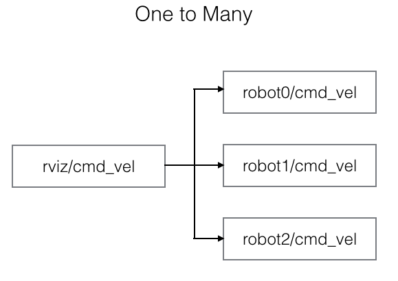

ROS Topic Namespace Multiplexer
=============

The existing topic-tools [mux](http://wiki.ros.org/topic_tools/mux) only allows you to route multiple incoming topics into one outgoing topic. But this package allows you to both demultiplex many-to-one connections and multiplex one-to-many connections.




This is useful during instances when you want to control multiple robots using Rviz (see [multi_map_navigation](https://github.com/MohitShridhar/multi_map_navigation)).

## Dependencies & Prerequisites
[ROS Hydro](http://wiki.ros.org/hydro), [Catkin](http://wiki.ros.org/catkin): [topic_tools](http://wiki.ros.org/topic_tools), [tf](http://wiki.ros.org/tf) (see [package.xml](package.xml))

## Installation
Clone Repo:
```bash
$ cd <catkin_ws>/src
$ git clone https://github.com/MohitShridhar/namespace_mux.git
```
Resolve dependencies (in Ubuntu) & Compile:
```bash
$ cd <catkin_ws>
$ rosdep install --from-paths src --ignore-src --rosdistro hydro -y
$ catkin_make --pkg namespace_mux
```

## Guide

See [wiki](https://github.com/MohitShridhar/namespace_mux/wiki/User-Guide) for more details.